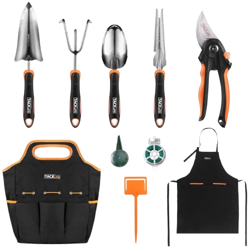

# 123 Realiza

## Integrantes

<table style="width: 100%; display:flex; border-collapse: collapse; text-align: center; align-items: center;">
  <thead>
    <tr>
      <th style="padding: 10px; text-align: center;"><a href="https://github.com/ManoTilts" target="_blank">Felipe Mazzeo Barboza</th>
      <th style="padding: 10px; text-align: center;"><a href="https://github.com/KonradoRibeiro" target="_blank">Konrado Ribeiro Filho</th>
      <th style="padding: 10px; text-align: center;"><a href="https://github.com/PedroNomura" target="_blank">Pedro Nomura Picchioni</th>
      <th style="padding: 10px; text-align: center;"><a href="https://github.com/Victor-Vaglieri" target="_blank">Victor Vaglieri de Oliveira </th>
    </tr>
  </thead>
  <tbody>
    <tr>
      <td style="padding: 10px; text-align: center; vertical-align: middle;">
        <a href="https://github.com/ManoTilts" target="_blank">
          
        </a>
      </td>
      <td style="padding: 10px; text-align: center; vertical-align: middle;">
        <a href="https://github.com/KonradoRibeiro" target="_blank">
          
        </a>
      </td>
      <td style="padding: 10px; text-align: center; vertical-align: middle;">
        <a href="https://github.com/PedroNomura" target="_blank">
          
        </a>
      </td>
      <td style="padding: 10px; text-align: center; vertical-align: middle;">
        <a href="https://github.com/Victor-Vaglieri" target="_blank">
          
        </a>
      </td>
    </tr>
  </tbody>
  <tfoot>
    <tr>
      <th style="padding: 10px; text-align: center;">10402808</th>
      <th style="padding: 10px; text-align: center;">10435499</th>
      <th style="padding: 10px; text-align: center;">10401616</th>
      <th style="padding: 10px; text-align: center;">10400787</th>
    </tr>
  </tfoot>
</table>


<!--
+ [Felipe Mazzeo Barboza](https://github.com/ManoTilts/ManoTilts) - 10402808
+ [Konrado Ribeiro Filho]() - 10435499
+ [Pedro Nomura Picchioni](https://github.com/PedroNomura) - 10401616
+ [Victor Vaglieri de Oliveira](https://github.com/Victor-Vaglieri) - 10400787
-->
---
## Ideação do Projeto

A ideação teve como ponto de partida a identificação de uma necessidade observada em um pequeno comércio pertencente a um familiar de um dos integrantes da equipe. Nesse primeiro momento, observou-se a dificuldade que o comerciante enfrentava para se ajustar às novas exigências do mercado online. Com base nessa observação, decidiu-se que a proposta seria a criação de uma solução digital que viabilizasse a criação de um ambiente online para a exposição dos produtos e realização de vendas. O objetivo principal é montar um sistema que ajude a modernizar suas atividades comerciais e ampliar sua presença no ambiente digital.


---
## Protótipo

### Desktop


### Mobile


<!--  -->

<!-- caso tenha varias imagens seria bom colocar o que cada uma delas representas, o que o usuario esta fazendo e etc...-->
<!-- do David https://github.com/david-pessoa/web-mobile/blob/main/README.md--> 
---
## Caráter Extensionista

O caráter extensionista do projeto está na busca por resolver um problema identificado em um comércio. A solução tecnológica proposta possui potencial de replicação em outros contextos semelhantes, funcionando como um modelo acessível para pequenos empreendedores que enfrentam dificuldades de inserção no ambiente digital. Dessa forma, a iniciativa demonstra como ferramentas tecnológicas simples e funcionais podem ser aplicadas em comércios locais, contribuindo para o fortalecimento desses negócios e gerando impacto positivo ao responder, de maneira prática, às exigências do mercado atual.

---
## Tutorial

### 1. HTML
#### Cabeçalho (header)

+ Logotipo da 123 Realiza (classe chamada logotipo)
+ Barra de busca contendo um campo de entrada e um botão (classe chamada container-busca)
+ Menu de navegação (classe chamada menu-navegacao)
+ Ícones de carrinho e conta Botão de menu mobile para telas menores (classe chamada botao-menu-mobile)

```html
<header>
    <nav>
        <section class="logotipo">
            <h1>123 Realiza</h1>
        </section>
        <section class="container-busca">
            <input type="text" placeholder="Buscar produtos..." name="campo-busca" class="campo-busca">
            <button type="button" class="botao-busca">Buscar</button>
        </section>
        <ul class="menu-navegacao">
            <li><a href="#inicio">Início</a></li>
            <li><a href="#produtos">Produtos</a></li>
            <li><a href="#categorias">Categorias</a></li>
            <li><a href="#sobre">Sobre</a></li>
            <li><a href="#contato">Contato</a></li>
            <!-- <li><a href="#busca" class="icone-busca">🔍</a></li> -->
            <li><a href="#carrinho" class="icone-carrinho">🛒</a></li>
            <li><a href="#conta" class="icone-conta">👤</a></li>
        </ul>
        <!-- <section class="icones-navegacao">
            <a href="#busca" class="icone-busca">🔍</a>
            <a href="#carrinho" class="icone-carrinho">🛒</a>
            <a href="#conta" class="icone-conta">👤</a>
        </section> -->
        <!-- Botão do menu mobile -->
        <section class="botao-menu-mobile">☰</section>
    </nav>
</header>
```

#### Conteúdo principal (Main)

##### Seção inicial

+ Mostra uma mensagem de boas-vindas e imagem destacada.
+ class="destinos-nav" ajuda no scroll suave ao clicar no menu.

```html
<section id="inicio" class="secao-principal destinos-nav">
    <section class="conteudo-principal">
        <h2>Bem-vindo à 123 Realiza</h2>
        <p>Sua loja online com os melhores produtos</p>
    </section>
    <figure class="imagem-principal">
        
    </figure>
</section>
```

##### Seção de categorias

+ Cada categoria é representada por imagem + título.
+ Utiliza grid para alinhar automaticamente os itens.

```html
<section id="categorias" class="secao-categorias destinos-nav">
    <h2>Categorias</h2>
    <section class="grade-categorias">
        <article class="item-categoria">
            
            <h3>Eletrônicos</h3>
        </article>
        <article class="item-categoria">
            
            <h3>Roupas</h3>
        </article>
        <article class="item-categoria">
            
            <h3>Casa & Jardim</h3>
        </article>
        <article class="item-categoria">
            
            <h3>Esportes</h3>
        </article>
        <article class="item-categoria">
            
            <h3>Livros</h3>
        </article>
        <article class="item-categoria">
            
            <h3>Beleza</h3>
        </article>
    </section>
</section>
```

##### Produtos em Destaque

+ Cada produto é um cartão com imagem, título, descrição, preço e botão.
+ Pode ter etiquetas como “Oferta” ou “Novo”.
+ grade-produtos usa grid responsivo.

```html
<section id="produtos" class="produtos-destaque destinos-nav">
    <h2>Produtos em Destaque</h2>
    <section class="grade-produtos">
        <article class="cartao-produto">
            <figure class="imagem-produto">
                
                <figcaption class="etiqueta-produto">Oferta</figcaption>
            </figure>
            <section class="info-produto">
                <h3>Smartphone Samsung Galaxy</h3>
                <p class="descricao-produto">Smartphone com tela de 6.1 polegadas e câmera tripla</p>
                <section class="preco-produto">
                    <span class="preco-antigo">R$ 1.299,99</span>
                    <span class="preco-atual">R$ 999,99</span>
                </section>
                <button class="botao-adicionar">Adicionar ao Carrinho</button>
            </section>
        </article>

        <article class="cartao-produto">
            <figure class="imagem-produto">
                
            </figure>
            <section class="info-produto">
                <h3>Camiseta Polo Masculina</h3>
                <p class="descricao-produto">Camiseta polo de algodão 100% em diversas cores</p>
                <section class="preco-produto">
                    <span class="preco-atual">R$ 89,99</span>
                </section>
                <button class="botao-adicionar">Adicionar ao Carrinho</button>
            </section>
        </article>

        <article class="cartao-produto">
            <figure class="imagem-produto">
                
                <figcaption class="etiqueta-produto">Novo</figcaption>
            </figure>
            <section class="info-produto">
                <h3>Notebook Lenovo IdeaPad</h3>
                <p class="descricao-produto">Notebook com processador Intel Core i5 e 8GB RAM</p>
                <section class="preco-produto">
                    <span class="preco-atual">R$ 2.299,99</span>
                </section>
                <button class="botao-adicionar">Adicionar ao Carrinho</button>
            </section>
        </article>

        <article class="cartao-produto">
            <figure class="imagem-produto">
                
            </figure>
            <section class="info-produto">
                <h3>Kit Jardim Completo</h3>
                <p class="descricao-produto">Kit com ferramentas básicas para jardinagem</p>
                <section class="preco-produto">
                    <span class="preco-atual">R$ 79,99</span>
                </section>
                <button class="botao-adicionar">Adicionar ao Carrinho</button>
            </section>
        </article>

        <article class="cartao-produto">
            <figure class="imagem-produto">
                
            </figure>
            <section class="info-produto">
                <h3>Tênis Esportivo Nike</h3>
                <p class="descricao-produto">Tênis para corrida com tecnologia Air Max</p>
                <section class="preco-produto">
                    <span class="preco-atual">R$ 299,99</span>
                </section>
                <button class="botao-adicionar">Adicionar ao Carrinho</button>
            </section>
        </article>

        <article class="cartao-produto">
            <figure class="imagem-produto">
                
            </figure>
            <section class="info-produto">
                <h3>Kit Maquiagem Completo</h3>
                <p class="descricao-produto">Kit com batom, base, rímel e sombras variadas</p>
                <section class="preco-produto">
                    <span class="preco-atual">R$ 129,99</span>
                </section>
                <button class="botao-adicionar">Adicionar ao Carrinho</button>
            </section>
        </article>
    </section>
</section>
```

##### Newsletter

+ Formulário simples para captura de e-mails.
+ Input com required garante que o campo não fique vazio.

```html
<section class="secao-newsletter">
    <section class="conteudo-newsletter">
        <h2>Fique por Dentro das Novidades</h2>
        <p>Receba ofertas especiais e lançamentos direto no seu e-mail</p>
        <form class="formulario-newsletter">
            <input type="email" placeholder="Seu e-mail" required>
            <button type="submit">Inscrever-se</button>
        </form>
    </section>
</section>
```

##### Seção Sobre

+ Explica a empresa e seus diferenciais.
+ Diferenciais organizados em cartões com título e descrição.

```html
<section id="sobre" class="secao-sobre destinos-nav">
    <section class="conteudo-sobre">
        <h2>Sobre a 123 Realiza</h2>
        <p>Somos uma loja online comprometida em oferecer os melhores produtos com qualidade e preços acessíveis. Nossa
            missão é facilitar suas compras e proporcionar uma experiência única de e-commerce.</p>
        <section class="diferenciais">
            <section class="diferencial">
                <h3>Entrega Rápida</h3>
                <p>Entregamos seus produtos com segurança e agilidade</p>
            </section>
            <section class="diferencial">
                <h3>Qualidade Garantida</h3>
                <p>Produtos selecionados com rigoroso controle de qualidade</p>
            </section>
            <section class="diferencial">
                <h3>Atendimento 24/7</h3>
                <p>Suporte disponível para ajudar você a qualquer momento</p>
            </section>
        </section>
    </section>
```

##### Carrinho de Compras (Lateral)

+ Carrinho oculto por padrão (right: -400px).
+ Abre lateralmente com classe aberto.
+ Lista de itens preenchida dinamicamente via JS (não incluído no projeto atual).

```html
<section id="carrinho" class="lateral-carrinho destinos-nav">
    <section class="cabecalho-carrinho">
        <h2>Carrinho de Compras</h2>
        <button class="fechar-carrinho">✕</button>
    </section>
    <section class="itens-carrinho">
        <!-- Itens do carrinho serão preenchidos dinamicamente -->
        <p class="carrinho-vazio">Seu carrinho está vazio</p>
    </section>
    <section class="rodape-carrinho">
        <section class="total-carrinho">
            <span>Total: R$ 0,00</span>
        </section>
        <button class="botao-finalizar">Finalizar Compra</button>
    </section>
</section>
```

#### Rodapé (footer)

+ Contém informações de contato, redes sociais e formas de pagamento.
+ Layout responsivo e adaptável para mobile/tablet.

```html
<footer id="contato" class="destinos-nav">
    <section class="conteudo-rodape">
        <section class="secao-rodape">
            <h3>123 Realiza</h3>
            <p>Sua loja online de confiança</p>
            <section class="links-sociais">
                <a href="#">Facebook</a>
                <a href="#">Instagram</a>
                <a href="#">Twitter</a>
            </section>
        </section>

        <section class="secao-rodape">
            <h3>Atendimento</h3>
            <ul>
                <li>Telefone: (11) 99999-9999</li>
                <li>E-mail: contato@123realiza.com.br</li>
                <li>WhatsApp: (11) 99999-9999</li>
            </ul>
        </section>

        <section class="secao-rodape">
            <h3>Formas de Pagamento</h3>
            <section class="metodos-pagamento">
                <span>Cartão de Crédito</span>
                <span>PIX</span>
                <span>Boleto</span>
            </section>
        </section>
    </section>

    <section class="base-rodape">
        <p>&copy; 2024 123 Realiza. Todos os direitos reservados.</p>
    </section>
</footer>
```

### 2. CSS

#### Estilos base, Resets e Variaveis

+ Reset de Estilos: Remoção de margens e paddings padrões de todos os elementos e definição do box-sizing como border-box.
+ Definição de Variáveis Globais: Criação de variáveis para gerenciar cores, espaçamentos, altura do header, bordas arredondadas e sombras, facilitando a manutenção do código.
+ Configuração Base (HTML e Body): Definição de estilos fundamentais como fonte, cor, altura e a implementação de uma rolagem suave (scroll-behavior).
+ Criação da Classe .container: Implementação de uma classe para centralizar o conteúdo e limitar sua largura máxima na página.

```css
/* Reset de CSS */
* {
    margin: 0;
    padding: 0;
    box-sizing: border-box;
}

/* Variáveis CSS */
:root {
    --altura-header: 70px;
    --cor-primaria: #232f3e;
    --cor-secundaria: #4b9cff;
    --cor-background: #dae6f1;
    --cor-texto: #333;
    --cor-branca: #ffffff;
    --espacamento-pequeno: 10px;
    --espacamento-medio: 20px;
    --espacamento-grande: 30px;
    --border-radius: 8px;
    --sombra: 0 2px 10px rgba(0,0,0,0.1);
}

/* Estilos base */
html {
    height: 100%;
    scroll-behavior: smooth;
}

body {
    font-family: 'Arial', sans-serif;
    line-height: 1.6;
    color: var(--cor-texto);
    padding-top: var(--altura-header);
    background-color: var(--cor-background);
}

/* Container para largura máxima consistente */
.container {
    max-width: 1200px;
    margin: 0 auto;
    padding: 0 var(--espacamento-medio);
}

```

#### Cabeçalho e navegação

+ A seção principal (.secao-principal) é a primeira a ser vista e é organizada em duas colunas: texto e imagem.
+ Títulos, parágrafos e a imagem principal foram estilizados com dimensões, cores e bordas arredondadas.
  
```css
/* Estilos do cabeçalho */
header {
    position: fixed;
    top: 0;
    left: 0;
    width: 100%;
    height: var(--altura-header);
    background-color: var(--cor-primaria);
    color: var(--cor-branca);
    z-index: 1000;
    box-shadow: var(--sombra);
}

header nav {
    display: flex;
    align-items: center;
    justify-content: space-between;
    padding: 0 var(--espacamento-medio);
    height: 100%;
    max-width: 1200px;
    margin: 0 auto;
}

.logotipo h1 {
    font-size: 1.5rem;
    color: var(--cor-branca);
}

/* Barra de busca */
.container-busca {
    display: flex;
    flex: 1;
    max-width: 500px;
    margin: 0 var(--espacamento-medio);
}

.campo-busca {
    flex: 1;
    padding: 8px 12px;
    border: none;
    border-radius: var(--border-radius) 0 0 var(--border-radius);
    font-size: 14px;
}

.botao-busca {
    padding: 8px 16px;
    background-color: var(--cor-secundaria);
    color: var(--cor-branca);
    border: none;
    border-radius: 0 var(--border-radius) var(--border-radius) 0;
    cursor: pointer;
    font-weight: bold;
    transition: background-color 0.3s ease;
}

.botao-busca:hover {
    background-color: #3a8ce8;
}

/* Menu de navegação */
.menu-navegacao {
    display: flex;
    gap: var(--espacamento-medio);
    list-style: none;
    margin: 0;
    padding: 0;
}

.menu-navegacao a {
    text-decoration: none;
    color: var(--cor-branca);
    font-weight: 500;
    padding: 8px 12px;
    border-radius: var(--border-radius);
    transition: background-color 0.3s ease;
}

.menu-navegacao a:hover {
    background-color: rgba(255, 255, 255, 0.1);
}

/* Botão de menu mobile */
.botao-menu-mobile {
    display: none;
    background: none;
    border: none;
    color: var(--cor-branca);
    font-size: 1.5rem;
    cursor: pointer;
    padding: 5px;
}
```

#### Seções e grades (categorias e produtos)

+ As seções recebem padding e seus títulos são centralizados.
+ Uma grade (grid) é usada para organizar categorias e produtos de forma responsiva.
+ Itens individuais, como categorias e cartões de produto, possuem sombra, borda arredondada e efeito hover.

```css
/* Conteúdo principal */
main {
    min-height: calc(100vh - var(--altura-header));
}

.destinos-nav {
    scroll-margin-top: var(--altura-header);
}

/* Seção hero (principal) */
.secao-principal {
    display: flex;
    align-items: center;
    justify-content: space-between;
    padding: var(--espacamento-grande) var(--espacamento-medio);
    max-width: 1200px;
    margin: 0 auto;
    min-height: 400px;
}

.conteudo-principal {
    flex: 1;
    max-width: 500px;
}

.conteudo-principal h2 {
    font-size: 2.5rem;
    margin-bottom: var(--espacamento-medio);
    color: var(--cor-primaria);
}

.conteudo-principal p {
    font-size: 1.2rem;
    margin-bottom: var(--espacamento-grande);
    color: #666;
}

.imagem-principal {
    flex: 1;
    text-align: center;
}

.imagem-principal img {
    max-width: 100%;
    height: auto;
    border-radius: var(--border-radius);
}

/* Seções */
section {
    padding: var(--espacamento-grande) var(--espacamento-medio);
}

section h2 {
    text-align: center;
    font-size: 2rem;
    margin-bottom: var(--espacamento-grande);
    color: var(--cor-primaria);
}

/* Grade de categorias */
.grade-categorias {
    display: grid;
    grid-template-columns: repeat(auto-fit, minmax(150px, 1fr));
    gap: var(--espacamento-medio);
    max-width: 1200px;
    margin: 0 auto;
}

.item-categoria {
    background: var(--cor-branca);
    padding: var(--espacamento-medio);
    border-radius: var(--border-radius);
    text-align: center;
    box-shadow: var(--sombra);
    transition: transform 0.3s ease;
}

.item-categoria:hover {
    transform: translateY(-5px);
}

.item-categoria img {
    width: 100%;
    height: 100px;
    object-fit: cover;
    border-radius: var(--border-radius);
    margin-bottom: var(--espacamento-pequeno);
    background-color: #f0f0f0;
}

.item-categoria h3 {
    font-size: 1.1rem;
    color: var(--cor-primaria);
}

/* Grade de produtos */
.grade-produtos {
    display: grid;
    grid-template-columns: repeat(auto-fit, minmax(280px, 1fr));
    gap: var(--espacamento-grande);
    max-width: 1200px;
    margin: 0 auto;
}

.cartao-produto {
    background: var(--cor-branca);
    border-radius: var(--border-radius);
    overflow: hidden;
    box-shadow: var(--sombra);
    transition: transform 0.3s ease;
    display: flex;
    flex-direction: column;
}

.cartao-produto:hover {
    transform: translateY(-5px);
    box-shadow: 0 4px 20px rgba(0,0,0,0.15);
}

.imagem-produto {
    position: relative;
    height: 200px;
    overflow: hidden;
}

.imagem-produto img {
    width: 100%;
    height: 100%;
    object-fit: cover;
    background-color: #f0f0f0;
}

.etiqueta-produto {
    position: absolute;
    top: var(--espacamento-pequeno);
    right: var(--espacamento-pequeno);
    background-color: #e74c3c;
    color: var(--cor-branca);
    padding: 4px 8px;
    border-radius: var(--border-radius);
    font-size: 0.8rem;
    font-weight: bold;
}

.info-produto {
    padding: var(--espacamento-medio);
    flex: 1;
    display: flex;
    flex-direction: column;
}

.info-produto h3 {
    font-size: 1.2rem;
    margin-bottom: var(--espacamento-pequeno);
    color: var(--cor-primaria);
}

.descricao-produto {
    color: #666;
    font-size: 0.9rem;
    margin-bottom: var(--espacamento-pequeno);
    flex: 1;
}

.preco-produto {
    margin-bottom: var(--espacamento-medio);
}

.preco-antigo {
    color: #999;
    text-decoration: line-through;
    margin-right: var(--espacamento-pequeno);
}

.preco-atual {
    color: #27ae60;
    font-weight: bold;
    font-size: 1.2rem;
}

.botao-adicionar {
    background-color: var(--cor-secundaria);
    color: var(--cor-branca);
    border: none;
    padding: 12px;
    border-radius: var(--border-radius);
    cursor: pointer;
    font-weight: bold;
    transition: background-color 0.3s ease;
}

.botao-adicionar:hover {
    background-color: #3a8ce8;
}
```

#### Newsletter e Sobre

+ A seção de newsletter possui fundo colorido, conteúdo centralizado e um formulário com campos e botões estilizados.
+ A seção "Sobre" usa cards com grid e sombra para exibir informações e diferenciais da loja.

```css
/* Seção de newsletter */
.secao-newsletter {
    background-color: var(--cor-primaria);
    color: var(--cor-branca);
    text-align: center;
    padding: var(--espacamento-grande) var(--espacamento-medio);
}

.conteudo-newsletter {
    max-width: 600px;
    margin: 0 auto;
}

.conteudo-newsletter h2 {
    color: var(--cor-branca);
    margin-bottom: var(--espacamento-medio);
}

.conteudo-newsletter p {
    margin-bottom: var(--espacamento-grande);
    opacity: 0.9;
}

.formulario-newsletter {
    display: flex;
    max-width: 400px;
    margin: 0 auto;
    gap: 0;
}

.formulario-newsletter input {
    flex: 1;
    padding: 12px;
    border: none;
    border-radius: var(--border-radius) 0 0 var(--border-radius);
    font-size: 14px;
}

.formulario-newsletter button {
    padding: 12px 24px;
    background-color: var(--cor-secundaria);
    color: var(--cor-branca);
    border: none;
    border-radius: 0 var(--border-radius) var(--border-radius) 0;
    cursor: pointer;
    font-weight: bold;
    transition: background-color 0.3s ease;
}

.formulario-newsletter button:hover {
    background-color: #3a8ce8;
}

/* Seção Sobre */
.conteudo-sobre {
    max-width: 1200px;
    margin: 0 auto;
    text-align: center;
}

.conteudo-sobre p {
    font-size: 1.1rem;
    margin-bottom: var(--espacamento-grande);
    color: #666;
    max-width: 800px;
    margin-left: auto;
    margin-right: auto;
}

.diferenciais {
    display: grid;
    grid-template-columns: repeat(auto-fit, minmax(250px, 1fr));
    gap: var(--espacamento-grande);
    margin-top: var(--espacamento-grande);
}

.diferencial {
    background: var(--cor-branca);
    padding: var(--espacamento-grande);
    border-radius: var(--border-radius);
    box-shadow: var(--sombra);
}

.diferencial h3 {
    color: var(--cor-primaria);
    margin-bottom: var(--espacamento-medio);
    font-size: 1.3rem;
}

.diferencial p {
    color: #666;
    margin: 0;
}
```

#### Carrinho de compras

+ O carrinho de compras é lateral e permanece escondido inicialmente.
+ Ao ser aberto, ele desliza da direita, exibindo os itens, o total e um botão de finalizar compra com estilos consistentes e sombreados.

```css
/* Carrinho de compras */
.lateral-carrinho {
    position: fixed;
    top: 0;
    right: -400px;
    width: 400px;
    height: 100vh;
    background: var(--cor-branca);
    box-shadow: -2px 0 10px rgba(0,0,0,0.1);
    transition: right 0.3s ease;
    z-index: 1001;
    display: flex;
    flex-direction: column;
}

.lateral-carrinho.aberto {
    right: 0;
}

.cabecalho-carrinho {
    display: flex;
    justify-content: space-between;
    align-items: center;
    padding: var(--espacamento-medio);
    background-color: var(--cor-primaria);
    color: var(--cor-branca);
}

.fechar-carrinho {
    background: none;
    border: none;
    color: var(--cor-branca);
    font-size: 1.5rem;
    cursor: pointer;
}

.itens-carrinho {
    flex: 1;
    padding: var(--espacamento-medio);
    overflow-y: auto;
}

.rodape-carrinho {
    padding: var(--espacamento-medio);
    border-top: 1px solid #eee;
}

.total-carrinho {
    text-align: center;
    margin-bottom: var(--espacamento-medio);
    font-size: 1.2rem;
    font-weight: bold;
}

.botao-finalizar {
    width: 100%;
    padding: 12px;
    background-color: #27ae60;
    color: var(--cor-branca);
    border: none;
    border-radius: var(--border-radius);
    cursor: pointer;
    font-weight: bold;
    font-size: 1.1rem;
    transition: background-color 0.3s ease;
}

.botao-finalizar:hover {
    background-color: #219a52;
}
```


#### Rodapé

+ O rodapé (footer) usa grid para organizar as seções de informações, links e redes sociais.
+ Ele também possui uma base inferior com o texto de copyright, cores e espaçamentos padronizados.

```css
/* Rodapé */
footer {
    background-color: var(--cor-primaria);
    color: var(--cor-branca);
    margin-top: var(--espacamento-grande);
}

.conteudo-rodape {
    display: grid;
    grid-template-columns: repeat(auto-fit, minmax(250px, 1fr));
    gap: var(--espacamento-grande);
    padding: var(--espacamento-grande) var(--espacamento-medio);
    max-width: 1200px;
    margin: 0 auto;
}

.secao-rodape h3 {
    margin-bottom: var(--espacamento-medio);
    font-size: 1.2rem;
}

.secao-rodape ul {
    list-style: none;
}

.secao-rodape ul li {
    margin-bottom: 8px;
}

.links-sociais {
    display: flex;
    gap: var(--espacamento-medio);
    margin-top: var(--espacamento-medio);
}

.links-sociais a {
    color: var(--cor-branca);
    text-decoration: none;
    padding: 8px 12px;
    border-radius: var(--border-radius);
    background-color: rgba(255, 255, 255, 0.1);
    transition: background-color 0.3s ease;
}

.links-sociais a:hover {
    background-color: rgba(255, 255, 255, 0.2);
}

.metodos-pagamento {
    display: flex;
    flex-wrap: wrap;
    gap: var(--espacamento-pequeno);
    margin-top: var(--espacamento-medio);
}

.metodos-pagamento span {
    background-color: rgba(255, 255, 255, 0.1);
    padding: 4px 8px;
    border-radius: var(--border-radius);
    font-size: 0.9rem;
}

.base-rodape {
    border-top: 1px solid rgba(255, 255, 255, 0.2);
    padding: var(--espacamento-medio);
    text-align: center;
    background-color: rgba(0, 0, 0, 0.2);
}

```

#### Design Responsivo

+ São usadas media queries para adaptar a página em diferentes tamanhos de tela (desktop grande, desktop comum, tablet e mobile).
+ Esses ajustes de responsividade alteram os grids, tamanhos de fontes, paddings, a exibição de menus e o formulário de newsletter.

```css
/* Desktop */
@media (max-width: 1199px) {
    .grade-produtos {
        grid-template-columns: repeat(3, 1fr);
    }
    
    .grade-categorias {
        grid-template-columns: repeat(4, 1fr);
    }
}

/* Tablet */
@media (max-width: 768px) {
    :root {
        --altura-header: 60px;
        --espacamento-pequeno: 8px;
        --espacamento-medio: 15px;
        --espacamento-grande: 25px;
    }
    
/* Ajustes do cabeçalho */
    header nav {
        padding: 0 var(--espacamento-medio);
    }
    
    .logotipo h1 {
        font-size: 1.3rem;
    }
    
/* Ocultar barra de busca no tablet */
    .container-busca {
        display: none;
    }
    
/* Mostrar botão do menu mobile */
    .botao-menu-mobile {
        display: block;
    }
    
/* Ocultar navegação de desktop */
    .menu-navegacao {
        display: none;
    }
    
/* Seção hero */
    .secao-principal {
        flex-direction: column;
        text-align: center;
        padding: var(--espacamento-medio);
        min-height: 300px;
    }
    
    .conteudo-principal {
        max-width: 100%;
        margin-bottom: var(--espacamento-grande);
    }
    
    .conteudo-principal h2 {
        font-size: 2rem;
    }
    
/* Grades */
    .grade-produtos {
        grid-template-columns: repeat(2, 1fr);
        gap: var(--espacamento-medio);
    }
    
    .grade-categorias {
        grid-template-columns: repeat(3, 1fr);
    }
    
    /* Newsletter */
    .formulario-newsletter {
        flex-direction: column;
        gap: var(--espacamento-pequeno);
    }
    
    .formulario-newsletter input,
    .formulario-newsletter button {
        border-radius: var(--border-radius);
    }
    
/* Ajustes do carrinho */
    .lateral-carrinho {
        width: 100%;
        right: -100%;
    }
    
    /* Footer */
    .conteudo-rodape {
        grid-template-columns: repeat(2, 1fr);
        gap: var(--espacamento-medio);
    }
    
    .links-sociais {
        justify-content: center;
    }
}

/* Mobile */
@media (max-width: 480px) {
    :root {
        --altura-header: 60px;
        --espacamento-pequeno: 5px;
        --espacamento-medio: 10px;
        --espacamento-grande: 20px;
    }
    
/* Cabeçalho */
    header nav {
        padding: 0 var(--espacamento-medio);
    }
    
    .logotipo h1 {
        font-size: 1.1rem;
    }
    
    /* Hero section */
    .conteudo-principal h2 {
        font-size: 1.8rem;
        margin-bottom: var(--espacamento-medio);
    }
    
    .conteudo-principal p {
        font-size: 1rem;
    }
    
/* Títulos das seções */
    section h2 {
        font-size: 1.5rem;
    }
    
/* Grade de produtos - uma coluna no mobile */
    .grade-produtos {
        grid-template-columns: 1fr;
        gap: var(--espacamento-medio);
        padding: var(--espacamento-pequeno);
    }
    
/* Grade de categorias */
    .grade-categorias {
        grid-template-columns: repeat(2, 1fr);
        gap: var(--espacamento-medio);
    }
    
/* Cartões de produto */
    .cartao-produto {
        max-width: 100%;
    }
    
    .imagem-produto {
        height: 180px;
    }
    
    /* Footer */
    .conteudo-rodape {
        grid-template-columns: 1fr;
        text-align: center;
        gap: var(--espacamento-grande);
    }
    
    .links-sociais {
        justify-content: center;
    }
    
    .metodos-pagamento {
        justify-content: center;
    }
    
/* Ajustes de tipografia */
    .info-produto h3 {
        font-size: 1.1rem;
    }
    
    .descricao-produto {
        font-size: 0.85rem;
    }
    
    .preco-atual {
        font-size: 1.1rem;
    }
}
```

#### Menu mobile overlay

+ O menu mobile é um overlay que aparece ao clicar em um botão.
+ Ele ocupa a tela inteira com um fundo semitransparente e desliza a partir da direita.
+ Em dispositivos muito pequenos, as fontes, grids e paddings são ajustados para uma melhor visualização.

```css
/* Menu Mobile Overlay */
.overlay-menu-mobile {
    position: fixed;
    top: 0;
    left: 0;
    width: 100%;
    height: 100vh;
    background-color: rgba(0, 0, 0, 0.8);
    z-index: 2000;
    opacity: 0;
    visibility: hidden;
    transition: opacity 0.3s ease, visibility 0.3s ease;
}

.overlay-menu-mobile.ativo {
    opacity: 1;
    visibility: visible;
}

.conteudo-menu-mobile {
    position: absolute;
    top: 0;
    right: 0;
    width: 280px;
    height: 100vh;
    background-color: var(--cor-branca);
    padding: var(--espacamento-grande);
    transform: translateX(100%);
    transition: transform 0.3s ease;
    overflow-y: auto;
}

.overlay-menu-mobile.ativo .conteudo-menu-mobile {
    transform: translateX(0);
}

.fechar-menu-mobile {
    position: absolute;
    top: var(--espacamento-medio);
    right: var(--espacamento-medio);
    background: none;
    border: none;
    font-size: 1.5rem;
    cursor: pointer;
    color: var(--cor-primaria);
    padding: 5px;
}

.lista-menu-mobile {
    list-style: none;
    padding: 0;
    margin: 0;
    margin-top: 60px;
}

.lista-menu-mobile li {
    margin-bottom: var(--espacamento-pequeno);
}

.lista-menu-mobile a {
    display: block;
    padding: var(--espacamento-medio);
    text-decoration: none;
    color: var(--cor-primaria);
    font-weight: 500;
    font-size: 1.1rem;
    border-bottom: 1px solid #eee;
    transition: background-color 0.3s ease, color 0.3s ease;
}

.lista-menu-mobile a:hover {
    background-color: var(--cor-background);
    color: var(--cor-secundaria);
}
```

### 3. Javascript

#### Controle do Menu Mobile

+ Captura os elementos principais do menu (botão abrir, botão fechar, overlay, links).
+ A função toggleMenu() adiciona/remove a classe ativo para abrir/fechar.
+ O botão e os links do menu disparam o fechamento automático.

```javascript
const botaoMenuMobile = document.querySelector('.botao-menu-mobile');
const overlayMenu = document.querySelector('.overlay-menu-mobile');
const botaoFecharMenu = document.querySelector('.fechar-menu-mobile');
const linksMenuMobile = document.querySelectorAll('.lista-menu-mobile a');
function toggleMenu() {
    overlayMenu.classList.toggle('ativo');
}
botaoMenuMobile.addEventListener('click', toggleMenu);
botaoFecharMenu.addEventListener('click', toggleMenu);
linksMenuMobile.forEach(link => {
    if (!link.classList.contains('icone-carrinho')) {
        link.addEventListener('click', () => {
            if (overlayMenu.classList.contains('ativo')) {
                toggleMenu();
            }
        });
    }
});
```

#### Seleção dos elementos HTML, Função e Evento de abrir/fechar carrinho

+ Define variáveis para acessar o carrinho lateral e seus botões.
+ toggleCarrinho() abre/fecha o carrinho.
+ Ícones de carrinho e botão fechar disparam a função.

```js
const botoesAdicionar = document.querySelectorAll('.botao-adicionar');
const carrinhoLateral = document.querySelector('.lateral-carrinho');
const botaoFecharCarrinho = document.querySelector('.fechar-carrinho');
const itensCarrinhoContainer = document.querySelector('.itens-carrinho');
const totalCarrinhoSpan = document.querySelector('.total-carrinho span');
const iconesCarrinho = document.querySelectorAll('.icone-carrinho');
let carrinhoItens = []; 

function toggleCarrinho() {
    carrinhoLateral.classList.toggle('aberto');
}

iconesCarrinho.forEach(icone => icone.addEventListener('click', (e) => {
    e.preventDefault();
    toggleCarrinho();
    if (overlayMenu.classList.contains('ativo')) {
        toggleMenu();
    }
}));
botaoFecharCarrinho.addEventListener('click', toggleCarrinho);
```


#### Captura dos dados do produto

+ Ao clicar em “Adicionar”, o script pega nome, preço e imagem do produto.
+ Cria um objeto produto com essas informações.
+ Envia esse objeto para a função adicionarAoCarrinho().

```js
botoesAdicionar.forEach(botao => {
    botao.addEventListener('click', (event) => {
        const cartaoProduto = event.target.closest('.cartao-produto');
        const nomeProduto = cartaoProduto.querySelector('h3').innerText;
        const precoProdutoTexto = cartaoProduto.querySelector('.preco-atual').innerText;
        const imagemProdutoSrc = cartaoProduto.querySelector('.imagem-produto img').src;
        const precoProduto = parseFloat(precoProdutoTexto.replace('R$', '').replace('.','').replace(',', '.'));
        const idProduto = nomeProduto; 
        const produto = {
            id: idProduto,
            nome: nomeProduto,
            preco: precoProduto,
            imagem: imagemProdutoSrc
        };
        
        adicionarAoCarrinho(produto);
    });
});

```

#### Função para adicionar ao carrinho

+ Verifica se o produto já existe no array carrinhoItens.
+ Se existir, aumenta a quantidade; se não, adiciona o item novo.
+ Atualiza o carrinho e abre automaticamente caso esteja fechado.

```js
function adicionarAoCarrinho(produtoAdicionado) {
    const itemExistente = carrinhoItens.find(item => item.id === produtoAdicionado.id);
    if (itemExistente) {
        itemExistente.quantidade++;
    } else {
        carrinhoItens.push({ ...produtoAdicionado, quantidade: 1 });
    }
    atualizarCarrinho();
    if (!carrinhoLateral.classList.contains('aberto')) {
        toggleCarrinho();
    }
}
```

#### Atualizar a interface do carrinho

+ Limpa os itens atuais do HTML.
+ Se não houver produtos, mostra mensagem de carrinho vazio.
+ Para cada item: cria um article com imagem, nome, preço e botão remover.
+ Atualiza o total do carrinho em tempo real.

```js
function atualizarCarrinho() {
    itensCarrinhoContainer.innerHTML = '';
    if (carrinhoItens.length === 0) {
        itensCarrinhoContainer.innerHTML = '<p class="carrinho-vazio">Seu carrinho está vazio</p>';
        totalCarrinhoSpan.innerText = 'Total: R$ 0,00';
        return;
    }
    let total = 0;
    carrinhoItens.forEach(item => {
        const itemElemento = document.createElement('article');
        itemElemento.classList.add('item-carrinho-bloco');
        itemElemento.innerHTML = `
            <figure class="imagem-item-carrinho">
                
            </figure>
            <section class="detalhes-item-carrinho">
                <p class="nome-item-carrinho">${item.nome}</p>
                <p class="preco-item-carrinho">Preço: R$ ${item.preco.toFixed(2).replace('.', ',')}</p>
                <p class="quantidade-item-carrinho">Quantidade: ${item.quantidade}</p>
            </section>
            <button class="botao-remover-item" data-id="${item.id}">X</button>
        `;
        itensCarrinhoContainer.appendChild(itemElemento);
        
        total += item.preco * item.quantidade;
    });
    totalCarrinhoSpan.innerText = `Total: R$ ${total.toFixed(2).replace('.', ',')}`;
}
```


#### Remover itens do carrinho

+ Ouvinte de clique no container de itens.
+ Se o alvo do clique for um botão X, remove o item pelo id.
+ Atualiza o carrinho após a remoção.


```js
itensCarrinhoContainer.addEventListener('click', function(event) {
    if (event.target.classList.contains('botao-remover-item')) {
        const idParaRemover = event.target.getAttribute('data-id');
        carrinhoItens = carrinhoItens.filter(item => item.id !== idParaRemover);
        atualizarCarrinho();
    }
});
```

#### Confirmação da Newsletter

+ Captura o formulário da newsletter.
+ Intercepta o envio para não recarregar a página.
+ Mostra um alert() confirmando o cadastro do e-mail.

```js
const formNewsletter = document.querySelector('.formulario-newsletter');
formNewsletter.addEventListener('submit', (event) => {
    event.preventDefault(); 
    const inputEmail = formNewsletter.querySelector('input[type="email"]');
    const email = inputEmail.value;
    if (email) {
        alert(`Obrigado por se inscrever!\nSeu e-mail ${email} foi cadastrado com sucesso.`);
        inputEmail.value = '';
    }
});
```


#### Troca Automática da Imagem Principal

+ Define um array de imagens.
+ Sorteia uma para iniciar a página.
+ Usa setInterval() para trocar de imagem a cada 5 segundos.
+ Adiciona classe fade-out para criar transição suave.

```js
 // Lista de imagens disponíveis
const imagens = [
"img/lenovo.png",
"img/samsung galaxy.png",
"img/polo.png",
"img/kit.png",
"img/nike.png",
"img/maquiagem.png"
];
const imagemPrincipal = document.querySelector(".imagem-principal img");
const indiceAleatorio = Math.floor(Math.random() * imagens.length);
imagemPrincipal.src = imagens[indiceAleatorio];
let indice = 0;

setInterval(() => {
    imagemPrincipal.classList.add("fade-out");
    setTimeout(() => {
        indice = (indice + 1) % imagens.length;
        imagemPrincipal.src = imagens[indice];
        imagemPrincipal.classList.remove("fade-out");
    }, 1000); // mesmo tempo do CSS (1s)
}, 5000); // troca a cada 5s

```

---

### Aprendizados Adquiridos

O desenvolvimento deste projeto permitiu compreender de forma prática como unir diferentes tecnologias da web para criar uma solução completa. Foram aplicados conceitos de HTML para estruturar a página, CSS para definir o layout responsivo e JavaScript para adicionar interatividade, como o carrinho de compras, o menu para dispositivos móveis e a troca automática de imagens. 

Além do aspecto técnico, o trabalho reforçou a importância de pensar em soluções simples, acessíveis e funcionais, que possam atender às necessidades de diferentes usuários. O aprendizado obtido vai além da programação, mostrando como a tecnologia pode ser utilizada como ferramenta de apoio para ampliar oportunidades e facilitar o acesso ao ambiente digital.
